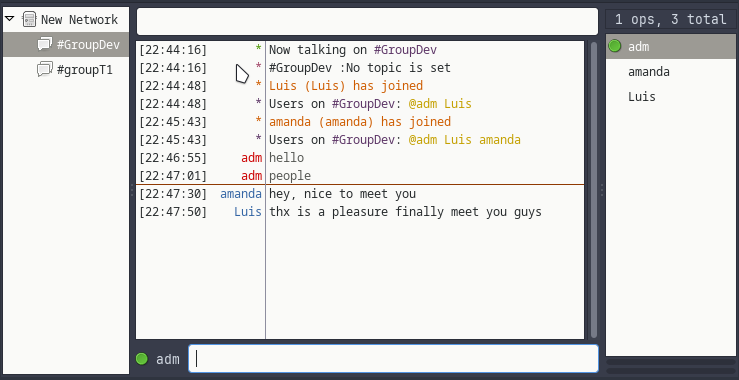
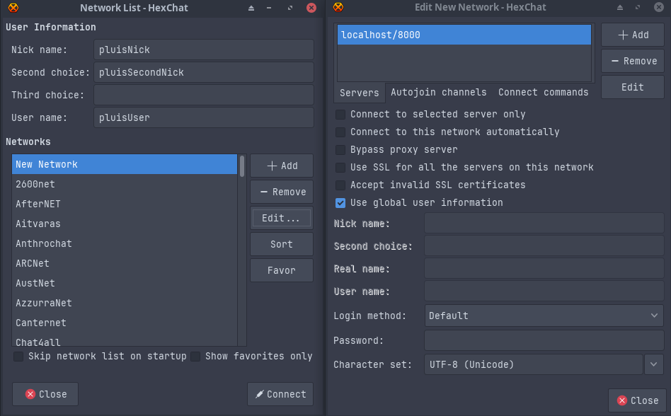

# IRC SERVER

- [IRC SERVER](#irc-server)
  - [Introduction](#introduction)
  - [Usage](#usage)
  - [Commands](#commands)
  - [Useful Links](#useful-links)


## Introduction

This project involves creating an Internet Relay Chat (IRC) server using C++ with [WebSockets](https://en.wikipedia.org/wiki/WebSocket).

IRC is a text-based communication protocol on the Internet that offers real-time messaging, either public or private. Users can exchange direct messages and join group channels.
<p align="center">
  
</p>
## Usage

For testing, we will use [HexChat](https://hexchat.github.io/index.html) as the client interface.

 **Clone the repository:**  
   `git clone https://github.com/pluis29/42_irc.git irc`

 
   IMPORTANT: *Make sure **clang** and **make** are installed.*
  <br><br/>

 **Build the project:**  
   Inside the `irc` folder, run:  
   ```sh
   make
   ```

 **Launch the application:**  
   You can launch the application with:  
   ```sh
   make run
   ```  
   or  
   ```sh
   ./ircserv <port> <password>
   ```  
   - `make run` will start the application on *port* `8000` with the *password* `123`.
  <br><br/>

 **Connect using HexChat:**
   - Set your *User Information*.
   - Under *Networks*, click on `+Add`, set your **IP/port**, and unset the option *Use SSL for all the servers on this Network*.
   - After configuration, click on **Connect** to start using the server.

<p align="center">
  
</p>

<h3>On First Access: Set Identification</h3> 

```sh
/PASS <password>
/NICK <nickname>
/USER <username> <hostname> <servername> <realname>
```
## Commands

1. **INVITE:**
   - **Purpose:** Invites a user to a specific channel.
   - **Usage:** `/invite <nick> <#channel>`

2. **JOIN:**
   - **Purpose:** Joins a user to a specific channel.
   - **Usage:** `/join <#channel>`

3. **KICK:**
   - **Purpose:** Removes a user from a channel.
   - **Usage:** `/kick <#channel> <nick> [<reason>]`

4. **MODE:**
   - **Purpose:** Sets modes (e.g., user modes or channel modes).
   - **Usage:** `/mode <#channel> <mode> [<mode params>]`

5. **NICK:**
   - **Purpose:** Changes a user's nickname.
   - **Usage:** `/nick <newnick>`

6. **PART:**
   - **Purpose:** Removes a user from a channel.
   - **Usage:** `/part <#channel> [<message>]`

7. **PASS:**
   - **Purpose:** Sets a password for connection.
   - **Usage:** `/pass <password>`

8. **PRIVMSG:**
   - **Purpose:** Sends a private message to a user or a message to a channel.
   - **Usage:** `/privmsg <target> <message>`

9. **QUIT:**
   - **Purpose:** Disconnects a user from the IRC server.
   - **Usage:** `/quit [<message>]`

10. **TOPIC:**
    - **Purpose:** Sets or retrieves the topic of a channel.
    - **Usage:** `/topic <#channel> [<newtopic>]`

11. **USER:**
    - **Purpose:** Registers a new user with the server.
    - **Usage:** `/user <username> <hostname> <servername> <realname>`

12. **WHO:**
    - **Purpose:** Lists users.
    - **Usage:** `/who` or `/who <#channel>`

13. **OPER:**
    - **Purpose:** Grants operator privileges.
    - **Usage:** `/oper <user> <password>`

## Useful Links

- [IRC Chat Protocol](https://datatracker.ietf.org/doc/html/rfc1459)
- [IRC Client Protocol](https://datatracker.ietf.org/doc/html/rfc2812)
- [IRC Server Protocol](https://datatracker.ietf.org/doc/html/rfc2813)
